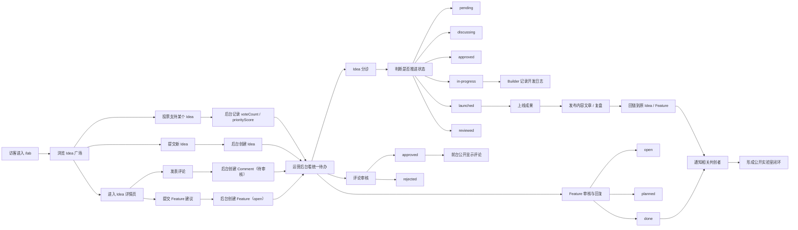

# AI 创造与实验专题 (AI Experiments) 产品需求与交互说明

## 1. 页面定位与核心理念
将过去单纯的“产品展示”拓展为更立体的**“AI 创造实录与前沿探索”**。
这里不仅有从 Open Lab 里孵化出来的产品复盘，还包括了站长在“公开实验”过程中的实践经验、Vibe Coding 技巧、工作流分享，以及对最新 AI 模型的硬核测评。
**核心心智**：“看一个 Builder 是如何用 AI 武装到牙齿的”。通过干货分享，建立专业信任，最终将流量导向个人的私域与公开实验室。

---

## 2. 用户角色与目标
*   **探索者/小白**：想了解现在 AI 能做到什么程度，寻找最新的模型测评和基础入门方法。
*   **创造者/同行 (Builders)**：想看 Vibe Coding 的真实踩坑记录，学习具体的工作流、Prompt 技巧和代码架构。
*   **站长 (Admin)**：将自己的实践过程体系化沉淀，通过“Takeaways（核心结论）”快速交付价值，并向其他板块（如 Lab）引流。

---

## 3. 核心功能结构与布局 (`two-column` 布局)

页面采用**经典的左右双栏**（左侧导航，右侧内容流），去除了繁杂的第三栏，让用户的视觉完全聚焦于干货本身。

### 3.1 左侧：动态导航侧栏 (Dynamic Side Nav)
*   **非硬编码设计**：摒弃写死的分类。分类导航树（Categories）直接通过读取 Payload CMS 中该专题下的现有分类动态生成。
*   **平滑滚动**：点击左侧某个分类（如“工作流与技巧”），右侧主体内容平滑滚动至对应锚点。
*   **实验室导流 (CTA)**：在导航树的最下方，固定挂载一个醒目的入口：“没找到想要的？👉 去 Open Lab 提需求”，实现“阅读 -> 共创”的闭环。

### 3.2 右侧：内容瀑布流 (Main Content Stream)
*   后端根据动态分类遍历拉取内容，形成错落有致的卡片瀑布流。
*   **高信息密度卡片设计**：
    *   **Meta 信息**：类型标签（`[Video]`, `[Article]`, `[Repo]`）、发布日期。
    *   **主标题**：清晰的动作导向标题（如“如何用 Cursor 3天做完 xxx”）。
    *   **🔥 Takeaways (核心结论前置)**：带浅色背景的区块，提炼 1-3 条核心干货。用户无需点击进入详情，即可获得阅读价值。
    *   **双排跳转**：根据后台配置，提供 [ 播放视频 ↗ ] 或 [ 阅读文字版 ↗ ] 的分流按钮。

---

## 4. 用户体验路径 (User Journeys)

### 4.1 路径 A：高效获取干货 (Quick Consume)
1. **进入页面**：用户进入 `/ai-experiments` 专题。
2. **扫描导航**：在左侧导航栏看到自己感兴趣的领域（比如“工作流与技巧”），点击直达。
3. **阅读结论**：在卡片列表中，用户扫读带背景色的“Takeaways”区块，迅速获得核心认知（比如“给 AI 坏例子比给好例子更管用”）。
4. **决定深度**：如果结论击中痛点，用户点击卡片进入 `/post/[id]` 查看完整复盘文章或跳转去 B站 看演示视频。

### 4.2 路径 B：从看客转变为共创者 (Reader to Co-creator)
1. **建立信任**：用户阅读了多篇硬核的实战复盘，认可了站长的创造能力和技术栈。
2. **产生共鸣**：用户在看“工具箱”或文章时，联想到自己一直没被满足的一个痛点。
3. **导流转化**：用户看到右侧栏的提示“遇到没解决的痛点？去 Open Lab 提需求”，点击进入 `/lab` 页面。
4. **闭环**：用户在 Lab 提交了一个新 Idea，完成了从单向“吸收内容”到双向“参与共创”的身份跃迁。

---

## 5. 数据结构与底层支撑
*   复用现有的 Payload CMS `Contents` 集合。
*   **需增加的字段扩展**：
    *   在 `Contents` 集合中，针对此专题的内容增加一个 `takeaways` 字段（Array of Strings 或富文本），专供列表卡片前置渲染核心结论使用。
    *   丰富 `category` 的枚举值，以支撑左侧导航的精确过滤（如 `build-in-public`, `workflow`, `ai-frontier`）。

